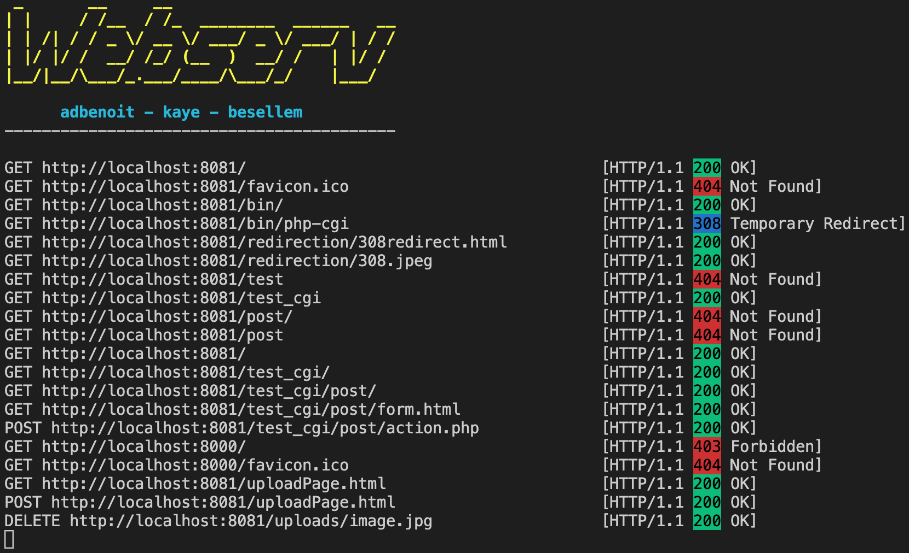

# WEBSERV
*This is when you finally understand why a URL starts with HTTP*

## Usage
```
$ git clone https://github.com/besellem/webserv.git
$ cd 42_Webserv/
$ make
$ ./webserv [config_file]
```
## Configuration File’s Structure

- [server block](#server_block)
- [location block](#location_block)

(accept ';' at the end of the line and comments(#))

### server_block

- **listen**: choose the port and the host of each server
- **server_name**: setup the server names or not
- **error_page**: setup default error pages
- **client_max_body_size**: limit client body size
- **location**: setup routes with one or multiple rules/configuration

```
server
{
    listen [host:port]
    server_name [list of names]
    error_page [list of error code] [file path]
    client_max_body_size [number of bytes]
    
    location [route]
    {
        ...
    }
}
```

### location_block
- **allow**: define a list of accepted HTTP Methods for the route
- **return**: define an HTTP redirection
- **root**: define a directory or a file from where the file should be search
- **autoindex**: turn on or off directory listing
- **index**: default file to answer if the request is a directory
- **cgi_pass**: execute CGI based on certain file extension
- **upload_store**: make the route able to accept uploaded files and configure where it should be saved
```
location [route]
{
    allow [list of methods]
    return [code] [path]
    root [path]
    index [list of index files]
    autoindex [on or off]
    cgi_pass [file extension] [path of the cgi script]
    upload_store [directory]
}
```

## Preview


*In collaboration with [besellem][1] and [kaye][2] 🔥*

[1]: https://github.com/besellem
[2]: https://github.com/kev-ye
